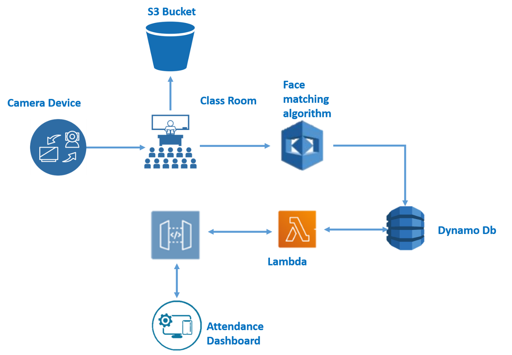

# AI-Powered-Hourly-Attendance-Capturing-System
This project is completed using Amazon Web Services. Let us first learn about the services used in the project.
## AWS Rekognition
Amazon Rekognition makes it easy to add image and video analysis to your applications using proven, highly scalable, deep learning technology that requires no machine learning expertise to use. With Amazon Rekognition, you can identify objects, people, text, scenes, and activities in images and videos, as well as detect any inappropriate content. Amazon Rekognition also provides highly accurate facial analysis and facial search capabilities that you can use to detect, analyze, and compare faces for a wide variety of user verification, people counting, and public safety use cases.

With Amazon Rekognition Custom Labels, you can identify the objects and scenes in images that are specific to your business needs. For example, you can build a model to classify specific machine parts on your assembly line or to detect unhealthy plants. Amazon Rekognition Custom Labels takes care of the heavy lifting of model development for you, so no machine learning experience is required. You simply need to supply images of objects or scenes you want to identify, and the service handles the rest.

Here are some links for reference:

<a href="https://aws.amazon.com/rekognition/">AWS Rekognition</a>

<a href="https://youtu.be/SZa2HfR-9Xc">Introduction to AWS Rekognition</a>

<a href="https://docs.aws.amazon.com/rekognition/latest/dg/labels-detect-labels-image.html">Detecting Labels in an image</a>

<a href="https://docs.aws.amazon.com/rekognition/latest/dg/labels-detecting-labels-video.html">Detecting Labels in a video</a>

<a href="https://docs.aws.amazon.com/rekognition/latest/dg/labels-detecting-custom-labels.html">Detecting Custom Labels</a>

<a href="https://docs.aws.amazon.com/rekognition/latest/dg/text-detection.html">Detecting Text</a>

## AWS Simple Storage Service (S3)
Amazon Simple Storage Service (Amazon S3) is an object storage service that offers industry-leading scalability, data availability, security, and performance. This means customers of all sizes and industries can use it to store and protect any amount of data for a range of use cases, such as websites, mobile applications, backup and restore, archive, enterprise applications, IoT devices, and big data analytics. Amazon S3 provides easy-to-use management features so you can organize your data and configure finely-tuned access controls to meet your specific business, organizational, and compliance requirements. Amazon S3 is designed for 99.999999999% (11 9's) of durability, and stores data for millions of applications for companies all around the world.

Here are some links for reference:

<a href="https://youtu.be/_I14_sXHO8U">Introduction to Amazon S3</a>

<a href="https://docs.aws.amazon.com/AmazonS3/latest/dev/Introduction.html">Getting started with S3</a>

## AWS API Gateway
Amazon API Gateway is a fully managed service that makes it easy for developers to create, publish, maintain, monitor, and secure APIs at any scale. APIs act as the "front door" for applications to access data, business logic, or functionality from your backend services. Using API Gateway, you can create RESTful APIs and WebSocket APIs that enable real-time two-way communication applications. API Gateway supports containerized and serverless workloads, as well as web applications.

API Gateway handles all the tasks involved in accepting and processing up to hundreds of thousands of concurrent API calls, including traffic management, CORS support, authorization and access control, throttling, monitoring, and API version management. API Gateway has no minimum fees or startup costs. You pay for the API calls you receive and the amount of data transferred out and, with the API Gateway tiered pricing model, you can reduce your cost as your API usage scales.

Here are some links for reference:

<a href="https://youtu.be/Tc1YIOAbyS0">Introduction to API Gateway</a>

<a href="https://docs.aws.amazon.com/apigateway/latest/developerguide/getting-started-with-lambda-integration.html">REST API with Lambda Integration</a>

<a href="https://aws.amazon.com/serverless/build-a-web-app/">Build a serverless web application</a>

## AWS DynamoDB
Amazon DynamoDB is a NoSQL database that supports key-value and document data models, and enables developers to build modern, serverless applications that can start small and scale globally to support petabytes of data and tens of millions of read and write requests per second. DynamoDB is designed to run high-performance, internet-scale applications that would overburden traditional relational databases.Amazon DynamoDB is a key-value and document database that delivers single-digit millisecond performance at any scale. It's a fully managed, multiregion, multimaster, durable database with built-in security, backup and restore, and in-memory caching for internet-scale applications.

## AWS Lambda
AWS Lambda lets you run code without provisioning or managing servers. With Lambda, you can run code for virtually any type of application or backend service - all with zero administration. Just upload your code and Lambda takes care of everything required to run and scale your code with high availability. You can set up your code to automatically trigger from other AWS services or call it directly from any web or mobile app.

Now, let us see the project details.

## Problem Definition
Maintaining attendance is very important in all the institutes for checking the attendance percentage of Students. Every institute has its own method in this regard. Some are taking attendance manually on the register for every hour and later they will upload every hour data of a class to the server or file-based approach and some have adopted methods of automatic attendance using some biometric techniques. But these methods are inefficient and time-consuming, AI can definitely find a solution to this problem.

## Proposed Solution
The proposed solution/application shall capture hourly attendance without any manual intervention. develop a smart device that can be integrated with a camera that will capture the images of class for every hour and send the images to model.  Then the model will use AWS Rekognition Service to recognize the student’s faces & push the images to S3(Simple Storage Service) for storage and also updates the attendance automatically in a database. build a web-based dashboard to visualize all the student’s attendance information.

## Project Flow
<ul>
<li>Store the Images of Students in S3 Bucket

<li>Capture the image on an Hourly basis

<li>Load the image to Face comparison algorithm (compares the faces in s3 bucket)

<li>Mark the attendance for compared faces and store in DynamoDb

<li>Create a rest API using API gateway and lambda function to connect to dynamo DB through web app

<li>Create a web-based dashboard to visualize the attendance
</ul>

## Proposed Technical Architecture

## Tasks
### Data Collection
Collect Student's/People's images.
### Configure AWS Cloud
<ul>
<li>Create AWS Educate Account/Free Tier Account - <a href="https://aws.amazon.com/education/awseducate/">AWS Educate</a></li>
  
<li>Install Boto3 library fir accessing AWS Services - <a href="https://aws.amazon.com/sdk-for-python/">SDK for Python</a></li>

<li>Compare faces using AWS Rekognition - <a href="https://docs.aws.amazon.com/rekognition/latest/dg/faces-comparefaces.html">Compare faces</a>, <a href="https://docs.aws.amazon.com/rekognition/latest/dg/compare-faces-console.html">Using Console</a></li>

<li>Create S3 bucket and store images, label them and draw bounding box - <a href="https://docs.aws.amazon.com/AmazonS3/latest/user-guide/create-bucket.html">Store images</a></li>

<li>Give public access to the bucket - <a href="https://docs.aws.amazon.com/AmazonS3/latest/user-guide/block-public-access-bucket.html">Public Access</a></li>

<li>Create DynamoDB Service and Store students info using Lambda function - <a href="https://youtu.be/BdQLwSWn0Z8">DynamoDB to store information</a></li>
</ul>

### Build a Model
<ul>
  <li>Write python code for video streaming - <a href="http://www.chioka.in/python-live-video-streaming-example/">Video Streaming example</a></li>
  
  <li>Compare captured image with stored images - <a href="https://docs.aws.amazon.com/rekognition/latest/dg/images-s3.html">Compare images</a></li>
  
  <li>Insert attendance information in DynamoDB - <a href="https://docs.aws.amazon.com/amazondynamodb/latest/developerguide/GettingStarted.Python.03.html#GettingStarted.Python.03.01">Inseting information</a></li>
</ul>

### Build an Application
<ul>
  <li>Create an HTML Application - <a href="https://www.w3schools.com/html/html_responsive.asp">HTML application</a></li>
  <li>Create Lambda function to get data from DynamoDB - <a href="https://youtu.be/P8okmPWIAcQ">Lambda function</a></li>
  <li>Display Student's attendance in web page - <a href="https://youtu.be/mfAT38B_uhw">Display information</a></li>
  <li>Deploy Application in Elastic Beanstalk - <a href="https://docs.aws.amazon.com/elasticbeanstalk/latest/dg/create-deploy-python-django.html?refid=gs_card">AWS Beanstalk</a></li>
  </ul>

## Demonstration
This link contains the video demonstration of the project using sample images - <a href="https://drive.google.com/file/d/1WAscOaCp-AY7B0CBY3PupHlZCpZTkT6h/view?usp=sharing">Demo Link</a>
